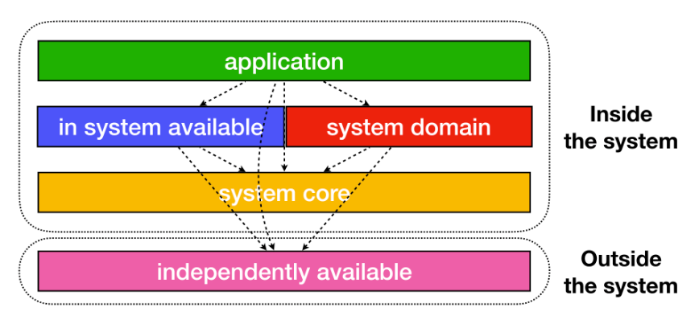

# Code-Koi Backend

## Modules

### Module architecture
* koi-backend
  * app-koi-api
  * commons
    * common-util
    * common-model
  * core-web
  * domain
  * clients
    * koi-redis-client

---
### Application module
> 클라이언트에게 API를 제공하거나, webhook을 받는다.
* ex) koi-api-app, admin-app
* Service와 Repository는 domain의 엔티티를 참조할 수 있다.
* custom projection을 사용한다면 app 모듈의 QueryRepository에서 구현한다.
* 모듈에 의존적인 기능이라고 생각하면 command의 기능을 수행할 수 있다.

---
### Domain module
> 각 도메인의 핵심 로직을 관리한다.

* app 모듈과 무관하게 비즈니스 핵심적이며 독립적인 로직을 가진다.
    * 만일 핵심이 아니며 해당 app 모듈에서만 사용된다면 그 모듈에서 구현한다.
    * 특정 API의 spec에 의존하는 쿼리가 있으면 안된다. 이러한 경우, app 모듈에서 구현한다.
* 도메인 로직은 @Entity에서 구현한다.
* 서비스는 유스케이스마다 클래스를 분리하여 구현한다.
* Spring Data JPA의 엔티티를 리턴하는 경우 domain에서 구현한다.
    * 특정 app에 강하게 의존한다고 생각하면 app에서 구현가능하다.
        * ex) Custom dto를 리턴하는 경우

---
### In-system module
> app / domain 모듈을 의존하지 않는 시스템 서포트 기능을 관리한다.
* ex) core-web(JWT, filter 기능) / 외부 시스템과 통신 / event publisher

---
### Common module
> 전체 모듈에서 사용되는 공통 로직을 관리한다.
* ex) common-model, common-util
* 최대한 외부 모듈에 의존하지 않는 순수 자바 클래스를 정의한다.
  * Spring/DB 관련 의존성은 사용하지 않는다.
* 가능한 common 모듈을 사용하지 않도록 하여 모듈의 크기를 최소화한다.

---

### Independently module

> redis, sqs 기능과 같은 시스템과 무관하게 사용가능한 모듈

* ex) koi-redis-client
* 해당 모듈 자체로 독립적인 역할을 수행할 수 있다.

---

[이미지 참고](https://techblog.woowahan.com/2637/)

## Convention

### 1. Domain의 서비스는 Usecase마다 클래스를 분리하여 구현한다.

* 유스케이스의 인터페이스는 public, 구현체는 default 클래스로 정의한다.
* app 모둘의 서비스에서 domain의 유스케이스들을 조합한다.

---

* why?
    * 하나의 서비스에 각 모듈에서 사용하는 많은 메서드가 생기는 것을 방지
    * 서비스의 의존관계 최소화 가능
    * Code conflict 최소화 가능

### 2. @OneToOne의 ***양방향***은 사용하지 않는다.

* 엔티티에 @OneToOne(mappedBy = "...")가 있거나 추가된다면 해당 포인트에서 반드시 N+1 문제 발생 (목록 조회 시)
    * 이를 해결하려면, Querydsl Projection을 주로 이용한다.
        * JPA의 지연로딩을 사용하지 못한다.
    * 트레이드 오프
        * @OneToOne 양방향 사용 시,
            * @OneToOne(mappedBy)의 양방향을 통한 객체 탐색 가능
            * 양방향이 추후 추가될 수 있어 모든 목록 조회쿼리는 Projection으로 처리해야함
        * 단방향 사용은 반대로 적용된다(양방향 탐색 X but, 자유로운 목록 조회)
* @OneToOne 양방향을 사용하지 않는걸 선택한다.